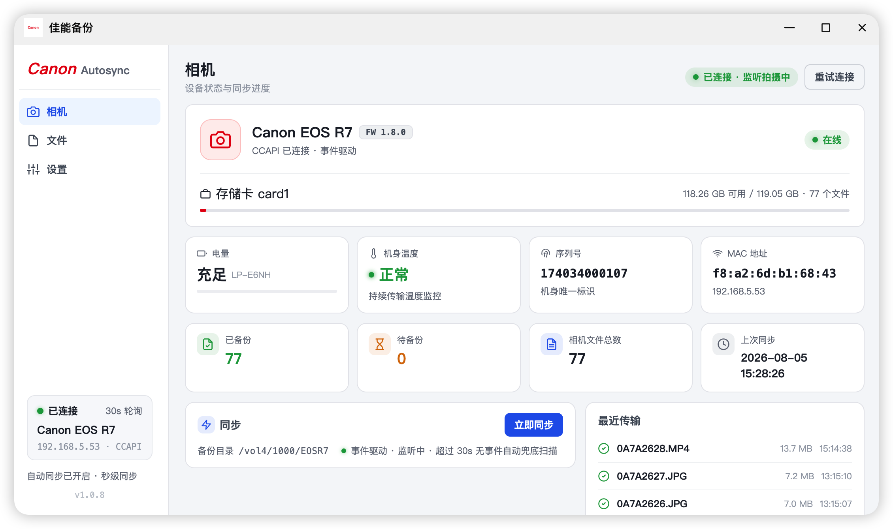

# canon-autosync

自动把佳能相机（CCAPI）里的照片/视频增量备份到 NAS 指定目录，保持相机目录结构。Python(FastAPI) 后端 + React(Vite) 前端，可本地运行，也可打包为 macOS/Windows 桌面应用、Docker 容器或飞牛 fnOS 应用（.fpk）。参考 [laszewsk/canon-r7-ccapi](https://github.com/laszewsk/canon-r7-ccapi)。

## 功能特性

- **秒级同步**：事件驱动监听相机，拍照/录视频后立即自动备份；事件驱动不可用时自动降级为定时扫描兜底（默认 60s，可配置）
- **传输保护**：同步前健康检查（相机过热/低电量自动暂停）、传输速率监控（Wi-Fi 弱时提示）、缩略图请求并发限制 + 失败重试 + 多级缓存（内存/磁盘/浏览器），避免相机 CCAPI 被并发打挂（503）
- **相机状态面板**：电量、机身温度、存储卡容量、序列号/MAC、同步进度实时显示
- **文件浏览**：已备份 / 待备份双标签（每 5s 自动刷新），列表/图标两种视图，支持文件名搜索、缩略图封面（RAW 提取内嵌 JPEG 预览、MP4/MOV 提取视频首帧，其余不可预览格式显示类型占位图标）、大图预览（键盘 ← → 切换、Esc 关闭）、视频在线播放
- **备份管理**：可手动删除备份（相机原文件进入忽略名单，不再自动传回），可随时恢复；可选"同步后删除卡上文件"


## 原理

相机开启 WiFi + CCAPI 后，后端主循环：

1. 健康检查（温度/电量）→ 递归列出 SD 卡全部文件 → 与本地同步记录对比，筛出待备份文件
2. 增量下载到 NAS 目录（保持相机目录结构），每传完一个文件即记录进度
3. 无待备份文件时进入事件监听：相机有新文件立即重新同步；相机不支持事件或超时，则按兜底间隔扫描

## 相机准备

1. 固件升级到支持 CCAPI 的版本（R7/R6/R5/R3/R10/R50/M50 II 等）
2. **激活 CCAPI**（只需一次）：解压 `ccapitool/` 中的压缩包，用 Activation Tool 通过 USB 连接相机激活（需 Windows）
3. 相机连接 Wi-Fi 后，在 Wi-Fi 设置 → Camera Control API → 连接，选择对应 Wi-Fi，屏幕出现 `http://<相机IP>:8080/ccapi`
4. 浏览器打开该地址，确认返回 JSON

注意：**"连接至智能手机"和"遥控(EOS Utility)"模式不会启动 CCAPI HTTP 服务**，必须用激活后出现的 CCAPI 连接选项。R7 文件浏览接口为 `/ccapi/ver130/contents`，客户端已按此实现。

## 快速开始（本地开发）

```bash
# 后端
cd backend
python3 -m venv .venv && source .venv/bin/activate
pip install -r requirements.txt
uvicorn app.main:app --port 8000

# 前端
cd frontend
npm install
npm run dev
```

打开 http://localhost:5173 ，在"设置"里填相机 IP（默认 192.168.5.53:8080）和备份目录。默认值也可用环境变量覆盖：

```bash
export CANON_IP=192.168.1.50        # 相机 IP
export NAS_PATH=/Volumes/photos/canon-backup   # 备份目录
```

配置和同步状态存于 `backend/data/`。

## 桌面应用（macOS / Windows）

基于 pywebview + PyInstaller：本地启动 FastAPI（动态空闲端口，仅监听 127.0.0.1），原生窗口加载前端，代码与后端完全复用。

```bash
cd frontend && npm run build   # 构建前端（首次）
pip install -r backend/requirements.txt -r desktop/requirements.txt
python desktop/entry.py        # 弹出桌面窗口
```

打包：

```bash
python desktop/make_icons.py   # 生成 icon.ico / icon.icns
pyinstaller desktop/CanonAutoSync.spec --noconfirm
```

产物：macOS `dist/CanonAutoSync.app`、Windows `dist/CanonAutoSync.exe`（单文件，Win10/11 自带 WebView2 Runtime）。打 `v*` tag 触发 GitHub Actions 双平台自动构建并附带至 Release。

数据目录（首次启动自动创建，备份目录默认 `~/Pictures/canon-backup`，可在界面设置中修改）：

- macOS：`~/Library/Application Support/canon-autosync/`
- Windows：`%APPDATA%\canon-autosync\`

macOS 首次打开提示"无法验证开发者"（应用未签名公证），任选其一绕过：

- 右键应用 →「打开」→ 弹窗点「打开」
- 系统设置 → 隐私与安全性 →「仍要打开」
- 命令行：`xattr -d com.apple.quarantine /Applications/CanonAutoSync.app`

## Docker 部署

适用于任何支持 Docker 的 NAS / 服务器（不限于飞牛）：

```bash
docker compose up -d --build   # 默认相机 IP 192.168.5.53、备份目录 /vol1/photos/canon-backup
```

打开 `http://<NAS IP>:8315`。可用 `.env` 覆盖默认配置：

```bash
CANON_IP=192.168.1.50                # 相机 IP
BACKUP_DIR=/vol1/photos/canon-backup # 照片备份目录（宿主路径）
DATA_DIR=./data                      # 配置与同步记录存储位置
```

部署要点：

- **host 网络模式**：相机经 Wi-Fi 接入宿主机网络（如 NAS 发射的 AP 热点），容器需共享宿主机网络栈才能直连相机 IP，故 `docker-compose.yml` 使用 `network_mode: host`，端口固定 8315
- **数据持久化**：配置/同步记录存于 `DATA_DIR` 卷、照片存于 `BACKUP_DIR` 卷，升级不丢失
- 多阶段构建：Node 构建前端 → Python 3.12 单容器托管（单端口 8315）

## 打包飞牛 fnOS 应用（.fpk）

```bash
./fpk/build.sh   # 构建前端 + 组装 + fnpack build
```

产物 `fpk/canon-autosync/canon-autosync.fpk`，在飞牛应用中心 → 手动安装 上传即可。

打包机制：

- 前端构建为静态文件，由 FastAPI 在 8315 端口直接托管（单端口）
- 依赖飞牛官方 Python 运行时（`install_dep_apps=python312`），首次启动自动创建 venv 并 pip install（需 NAS 能访问 PyPI）
- 安装向导询问相机 IP 和备份目录；使用自定义目录需在 应用设置 → 授权目录 中授权
- 配置和同步记录存于应用数据目录（`TRIM_PKGVAR`），升级不丢失；日志在 `app.log`

## API

| 方法 | 路径 | 说明 |
|---|---|---|
| GET | /api/status | 相机状态、同步进度、统计 |
| GET/POST | /api/config | 读取/保存配置 |
| POST | /api/sync | 手动触发同步 |
| POST | /api/sync/stop | 停止当前同步 |
| POST | /api/reconnect | 重试连接相机 |
| GET | /api/files | 已备份文件列表（offset/limit 分页） |
| DELETE | /api/files?path= | 删除已备份记录及其 NAS 上的文件 |
| POST | /api/files/restore?path= | 移出忽略名单，恢复自动备份 |
| GET | /api/pending | 相机上待备份文件 |
| GET | /api/thumb?path= | 相机文件缩略图（并发限制 + 缓存） |
| GET | /api/preview?path=&size= | 已备份文件预览/缩略图（仅限备份目录内，防目录穿越） |
